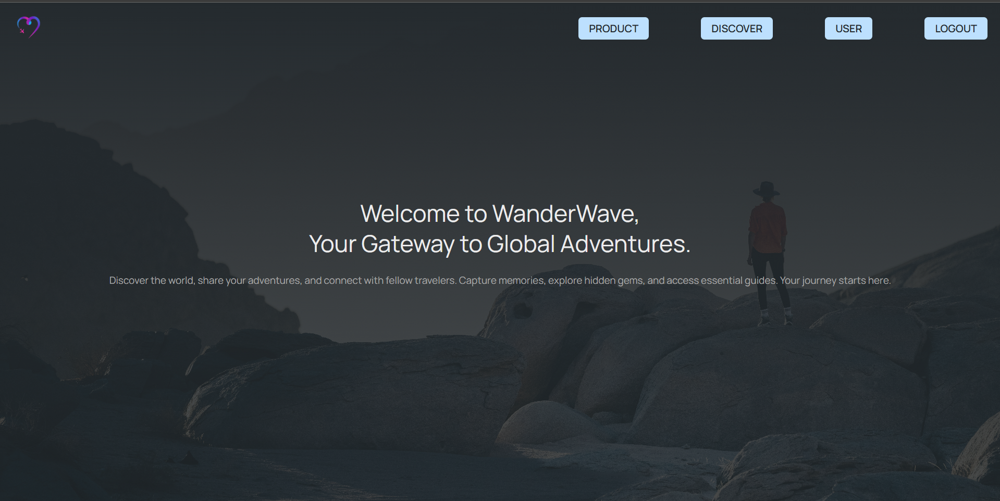
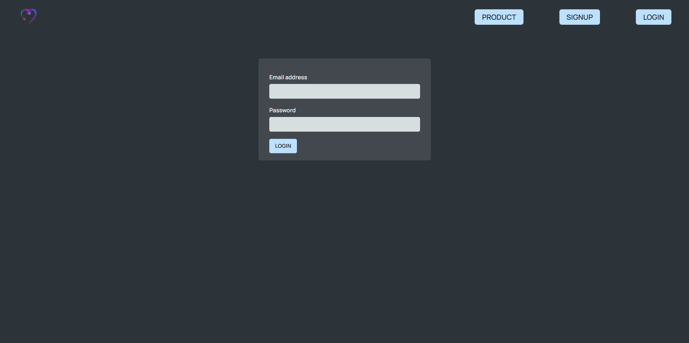
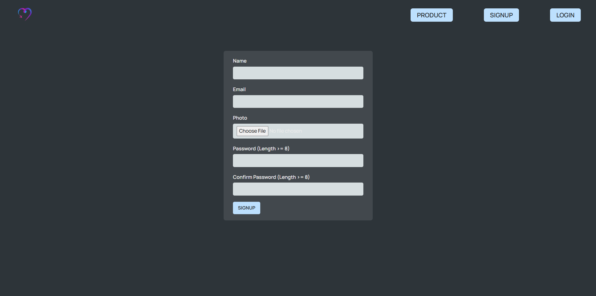
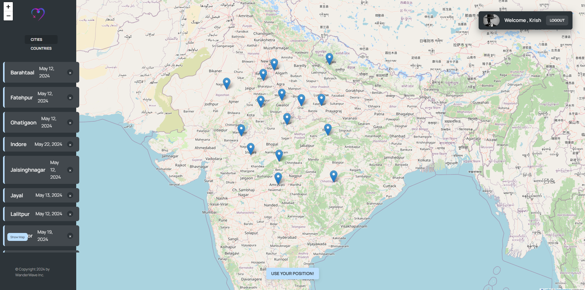

# WanderWave - A Travel Diary

Capture your adventures, one city at a time!
WanderWave is your ultimate travel companion, turning your journeys into a beautifully interactive map. Authenticate securely with JWT, mark the cities you've explored, and jot down your memorable experiences with personalized notes. Whether it's a bustling metropolis or a hidden gem, WanderWave helps you document every destination, date, and moment, making it easier than ever to relive your travel stories. Start your adventure today and let your travels leave a wave of memories!

## Features

- **User Authentication:** Allows users to sign up, log in, and manage their profiles securely using JWT.
- **Interactive Map:** Enables users to select and mark the cities they have traveled to.
- **Travel Notes:** Lets users add personalized notes, dates, and times for each visited city.
- **City Listings:** Displays a list of all the cities added by the user with their respective notes and visit details.
- **Search Functionality:** Allows users to search for specific cities they have added to their travel diary.
- **Responsive Design:** Ensures an optimal viewing and interaction experience across devices (desktops, tablets, and mobile phones).

## Technologies Used

- **MongoDB:** Database to store information regarding users and their respective cities.
- **Express.js:** Backend framework to handle server-side operations and API routes.
- **React.js:** Frontend library for building user interfaces.
- **Node.js:** Server-side environment to run JavaScript code.
- **HTML/CSS:** Markup and styling for the user interface.

## Setup Instructions

1. Clone the repository:

```
git clone https://github.com/xKrishnaSaxena/WanderWave.git
```

2. Install dependencies for frontend and backend:
   - Frontend:
   ```
   cd frontend && npm install
   ```
   - Backend:
   ```
    cd backend && npm install
   ```
3. Set up environment variables for MongoDB connection, API keys, etc.
4. Start the backend server:

```
cd backend && npm start
```

5. Start the frontend application:

```
cd frontend && npm run dev
```

6. Access the application via `http://localhost:5173` in your browser.

## Screenshots/Demo





